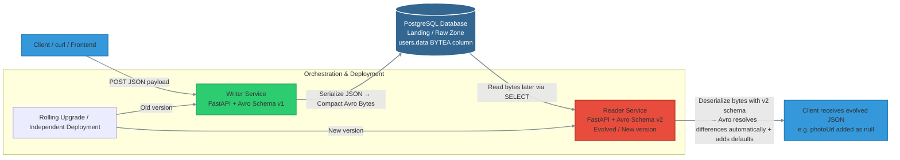

```mermaid
graph LR
    A[Client / curl / Frontend] -->|POST JSON payload| B[Writer Service<br>FastAPI + Avro Schema v1]

    B -->|Serialize JSON → Compact Avro Bytes| C[(PostgreSQL Database<br>Landing / Raw Zone<br>users.data BYTEA column)]

    C -->|Read bytes later via SELECT| D[Reader Service<br>FastAPI + Avro Schema v2<br>Evolved / New version]

    D -->|Deserialize bytes with v2 schema<br>→ Avro resolves differences automatically + adds defaults| E[Client receives evolved JSON<br>e.g. photoUrl added as null]

    subgraph "Orchestration & Deployment"
        Airflow[Rolling Upgrade / Independent Deployment] -->|New version| D
        Airflow -->|Old version| B
    end

    classDef postgres fill:#336791,stroke:#fff,stroke-width:2px,color:#fff
    classDef writer fill:#2ecc71,stroke:#27ae60,stroke-width:2px
    classDef reader fill:#e74c3c,stroke:#c0392b,stroke-width:2px
    classDef client fill:#3498db,stroke:#2980b9,stroke-width:2px

    class C postgres
    class B writer
    class D reader
    class A,E client

    linkStyle default stroke:#7f8c8d,stroke-width:2px
```