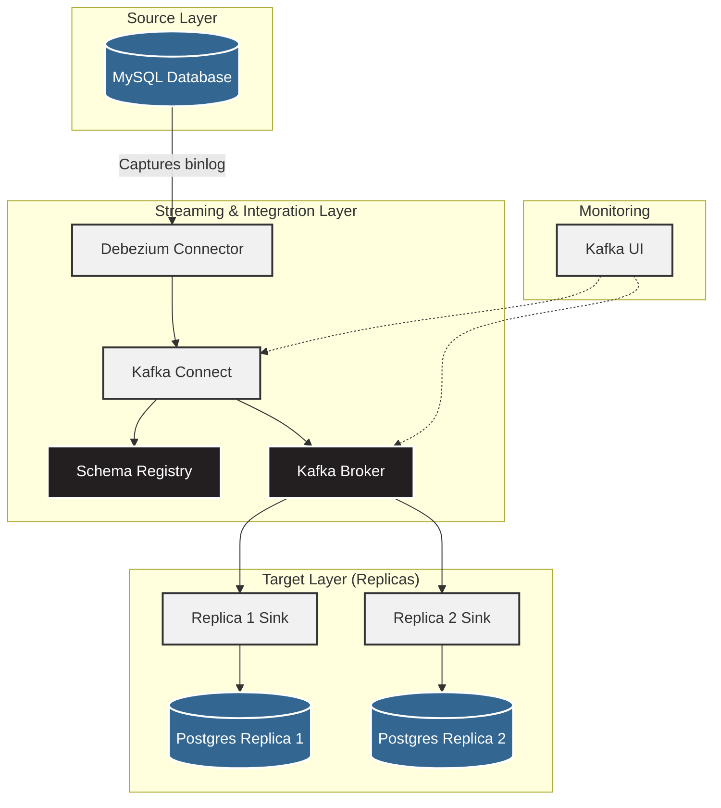

## Chapter 5: DATA REPLICATION

This project demonstrates a robust, scalable Change Data Capture (CDC) architecture that replicates data from a MySQL database to multiple PostgreSQL replicas in real-time using Apache Kafka and Kafka Connect.

### Architecture Overview

The pipeline leverages Debezium and Kafka Connect to capture row-level changes (INSERT, UPDATE, DELETE) from MySQL's binary logs and stream them to Kafka topics. Independent JDBC Sink connectors then consume these changes and apply them to multiple target PostgreSQL instances.

### Key Features
- **Real-Time Replication**: Low-latency data synchronization using log-based CDC.
- **Multi-Replica Support**: Scalable architecture supporting multiple independent sink targets.
- **Schema Evolution**: Avro serialization with Confluent Schema Registry ensures robust data types and schema versioning.
- **Fault-Tolerant**: Kafka provides a durable buffer between the source and target systems.

### Technologies Used
- **Database**: MySQL 8.0, PostgreSQL 15
- **Message Broker**: Apache Kafka (KRaft mode)
- **Data Integration**: Kafka Connect, Debezium, Confluent JDBC Sink
- **Serialization**: Avro
- **Monitoring**: Kafka-UI
- **Orchestration**: Docker Compose
